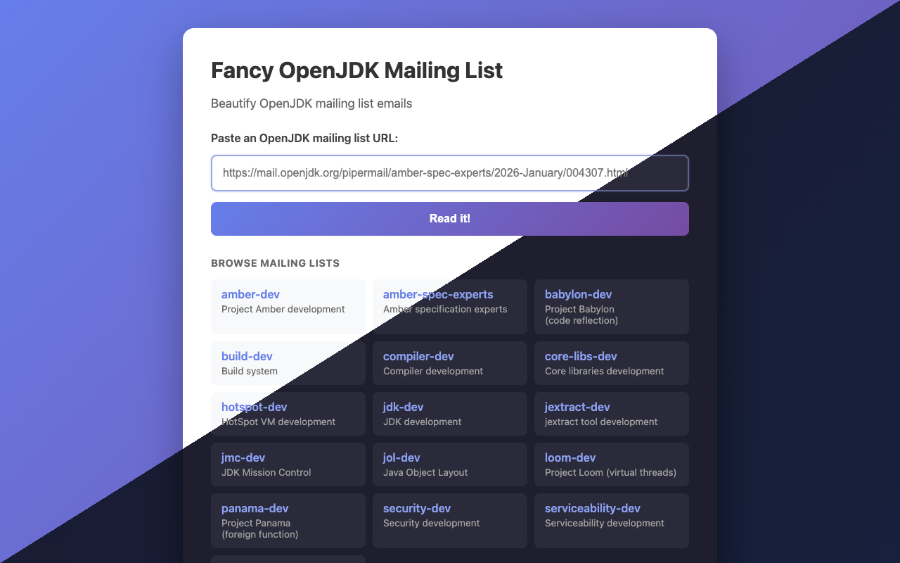
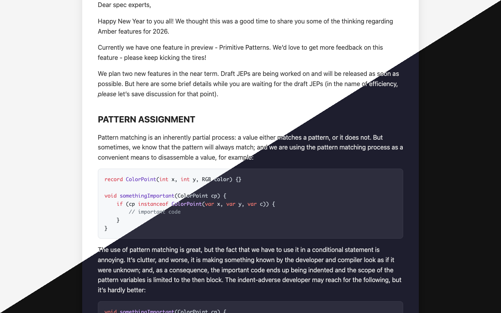

# Fancy Mail - OpenJDK Mailing List Beautifier

> [!IMPORTANT]
> This project was entirely generated by [Claude](https://www.anthropic.com/claude), Anthropic's AI assistant, as an experiment in AI-assisted software development.
> While Claude wrote all the code, it was steered toward specific problems and features through human prompts.
> No IDE was used.

A Micronaut application that fetches and beautifies emails from OpenJDK mailing lists, converting them to clean, readable markdown or rendered HTML.

## Features

- **CLI Mode**: Convert mailing list URLs to markdown files
- **Server Mode**: Web UI for browsing beautified emails
- **Dark/Light Mode**: Automatic theme switching based on system preferences
- **Thread Navigation**: Browse email threads with tree visualization
- **Link Rewriting**: Links to other mailing list emails automatically point to rendered versions
- **In-Memory Caching**: Fetched emails and threads are cached to reduce load on the mailing list server
- **Code Highlighting**: Syntax highlighting for code blocks
- **Thread Integrity**: Merkle tree-based verification of thread consistency

## Screenshots

| Home Page | Mail Content |
|-----------|--------------|
|  |  |

*Screenshots show light/dark mode diagonal merge*

## Requirements

- Java 21+
- Gradle 8.x (included via wrapper)

## Quick Start

### Server Mode

```bash
./gradlew run --args="--server"
```

This starts the server at `http://localhost:8080` and opens your browser automatically.

**Options:**
- `--port <port>`: Use a custom port (default: 8080)
- `--no-open`: Don't open browser automatically
- `--url <url>`: Open a specific email URL directly

```bash
# Custom port, don't open browser
./gradlew run --args="--server --port 9000 --no-open"

# Start server and open a specific email directly
./gradlew run --args="--server --url https://mail.openjdk.org/pipermail/amber-spec-experts/2026-January/004307.html"
```

### CLI Mode

Convert a mailing list URL to markdown:

```bash
# Print to stdout
./gradlew run --args="--url https://mail.openjdk.org/pipermail/amber-spec-experts/2026-January/004307.html"

# Save to file
./gradlew run --args="--url https://mail.openjdk.org/pipermail/amber-spec-experts/2026-January/004307.html --output email.md"
```

### Help

```bash
./gradlew run --args="--help"
```

## Web UI

### Home Page (`/`)

Paste an OpenJDK mailing list URL to beautify it:

```
https://mail.openjdk.org/pipermail/amber-spec-experts/2026-January/004307.html
```

### Rendered View (`/rendered/{list}/{year-month}/{id}.html`)

Direct URL access to rendered emails. The URL pattern mirrors the original mailing list URL:

- Original: `https://mail.openjdk.org/pipermail/amber-spec-experts/2026-January/004307.html`
- Rendered: `http://localhost:8080/rendered/amber-spec-experts/2026-January/004307.html`

### Markdown Export (`/markdown/{list}/{year-month}/{id}.md`)

Get the raw markdown for any email:

```
http://localhost:8080/markdown/amber-spec-experts/2026-January/004307.md
```

### Thread View (`/threads/{list}/{year-month}`)

Browse all email threads for a given month:

```
http://localhost:8080/threads/amber-spec-experts/2026-January
```

## Project Structure

```
app/src/main/java/dev/brice/fancymail/
├── Application.java              # Main entry point
├── FancyMailCommand.java         # CLI command (Picocli)
├── controller/                   # Web endpoints
│   ├── MailController.java       # Mail and thread endpoints
│   └── ErrorController.java      # Error handling
├── service/                      # Business logic
│   ├── MailFetcher.java          # HTTP client for fetching emails
│   ├── MailParser.java           # HTML parsing with Jsoup
│   ├── MarkdownConverter.java    # HTML to Markdown conversion
│   ├── LinkRewriter.java         # URL rewriting for proxy
│   ├── MailService.java          # Mail orchestration
│   ├── ThreadService.java        # Thread orchestration
│   ├── ThreadParser.java         # Thread HTML parsing
│   └── ThreadMerkleService.java  # Thread integrity verification
├── cache/                        # Caching layer
│   ├── MailCache.java            # Email cache
│   └── ThreadCache.java          # Thread cache
├── config/                       # Configuration classes
├── model/                        # Domain models
└── markdown/                     # Flexmark extensions

app/src/main/jte/                 # JTE templates
├── index.jte                     # Home page
├── rendered.jte                  # Rendered email view
├── threads.jte                   # Thread list view
└── ...                           # Other templates

app/src/main/resources/
├── application.yml               # Micronaut configuration
└── logback.xml                   # Logging configuration
```

## Configuration

Configuration is in `app/src/main/resources/application.yml`:

```yaml
micronaut:
  server:
    port: 8080

fancymail:
  cache:
    max-size: 1000           # Maximum cached emails
    expire-after-write: PT1H # Cache TTL (1 hour)
```

## Technology Stack

- **Framework**: [Micronaut 4.x](https://micronaut.io/)
- **CLI**: [Picocli](https://picocli.info/)
- **HTML Parsing**: [Jsoup](https://jsoup.org/)
- **Markdown Conversion**: [Flexmark](https://github.com/vsch/flexmark-java)
- **Template Engine**: [JTE](https://jte.gg/)
- **Caching**: [Caffeine](https://github.com/ben-manes/caffeine)

## Building

```bash
# Build
./gradlew build

# Run tests
./gradlew test

# Create distribution
./gradlew distZip
```

## Supported Mailing Lists

Any OpenJDK Pipermail mailing list is supported, including:

- `amber-dev`
- `amber-spec-experts`
- `core-libs-dev`
- `compiler-dev`
- `hotspot-dev`
- `jdk-dev`
- `panama-dev`
- `loom-dev`
- `valhalla-dev`

## License

[Mozilla Public License 2.0](LICENSE)
